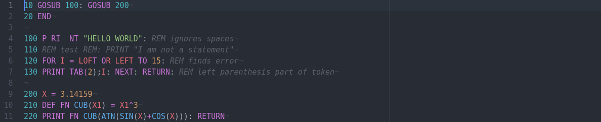

# atom-language-applesoft
Syntax recognition for Applesoft BASIC in the Atom editor.
Emulates behaviors of the Apple II ROM.
To install from within Atom press `Ctrl-,` or `Cmd-,`, select `Install`, and enter `applesoft` in the search box.

If you are interested in parsing Applesoft BASIC see [tree-sitter-applesoft](https://github.com/dfgordon/tree-sitter-applesoft).
